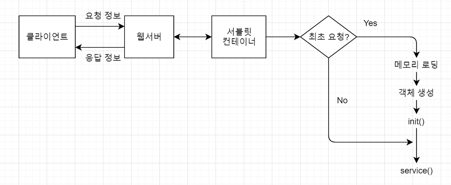

# Servlet

>서버 쪽에서 실행되면서 클라이언트의 요청에 따라 동적으로 서비스를 제공하는 자바클래스

## 실행순서

1. 클라이언트로부터 처리 요청 받음

   1. 클라이언트가 웹 브라우저를 통해 요청을 보내면 웹서버는 이를 받아서 요청정보의 헤더 안에 있는 URI 분석 이 때, 요청 받은 페이지가 서블릿이면 서블릿 컨테이너에 처리를 넘김

      서블릿 컨테이너는 요청 받은 서블릿을 WEB-INF/classes나 WEB-INF/lib에서 찾아서 실행 준비

2. 최초 요청 여부 판단

   1. 실행할 서블릿 객체가 메모리에 없으면 최초의 요청, 이미 있으면 최초의 요청이 아닌 것으로 판단

3. 서블릿 객체 생성 

   1. 서블릿 컨테이너는 요청 받은 서블릿이 최초의 요청이라면 해당 서블릿을 메모리에 로딩하고 객체를 생성 일반 자바 객체는 new 명령문으로 여러 개의 객체를 언제든지 직접 생성할 수 있지만, 서블릿은 최초 요청이 들어왔을 때 한 번만 객체를 생성하고 이 때 생성된 객체를 계속 사용

4. init() 메소드 실행

   1. 서블릿 객체가 생성된 후 호출되는 메소드이며 Servlet 인터페이스에 선언되어 있고,

       기능은 GenericServlet 클래스에 구현되어 있음 주로 서블릿 객체의 초기화 작업이 구현되어 있음 내용을 변경하고 싶다면 init() 메소드를 재정의

5. service() 메소드 실행 

   1. 행하는 서블릿의 요청 순서에 상관없이 클라이언트의 요청이 있을 때마다 실행

       실제 서블릿에서 처리해야 하는 내용이 구현되어 있음

       Servlet 인터페이스에 선언되어 있고, GenericServlet 클래스에 추상메소드로 선언되어 있으므로, HttpServlet 클래스에 메소드 몸체가 구현되어 있음 HttpServlet 클래스에 구현된 내용을 변경하고 싶다면 service() 메소드를 재정의